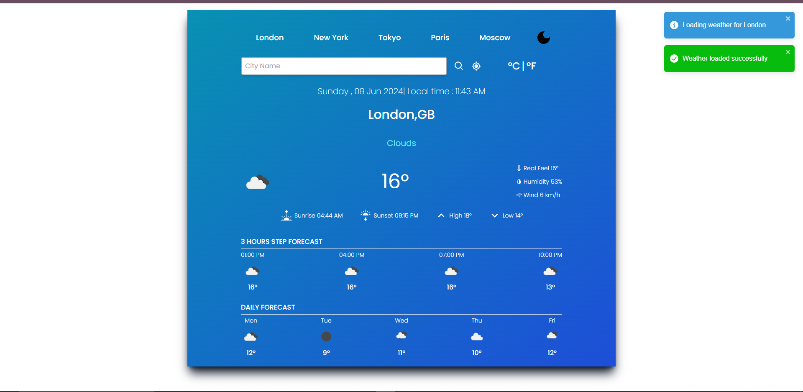

# WeatherWise

## Description
WeatherWise is a weather forecast application that provides current weather information, hourly forecasts, and daily forecasts. Users can search for weather by city name or use their current location to get weather updates. The application is built using React and utilizes weather data from a weather service API.

## How to Run Locally

### Prerequisites
- Node.js installed on your machine

### Steps
1. Clone the repository:
   ```bash
   git clone repository link
   cd WeatherNow
2. Install NPM packages:
   ```bash
   npm install
3. Start the development server:
   ```bash
   npm run dev
4. Open your browser and go to `http://localhost:5173` to view the application.

## Approach and Technologies Used
WeatherWise is built using React, a popular JavaScript library for building user interfaces. It makes use of modern JavaScript features and libraries to provide a smooth and interactive user experience. The key technologies and libraries used in the project include:


- React: JavaScript library for building user interfaces.
- React Icons: Icon library for React applications.
- react-toastify: Library for displaying toast notifications in React.
- OpenWeatherMap API: Weather service API used to fetch weather data.
- Luxon: Library for working with dates and times in JavaScript.
- Autoprefixer: Library for automatically adding vendor prefixes to CSS properties.

## Features
- Display current weather information.
- Display hourly forecast.
- Display daily forecast.
- Search for weather by city name.
- Get weather updates based on current location.
- Dark mode and light mode for user interface customization.
- 


## Credits
- Weather data provided by OpenWeatherMap API.
- Icons provided by React Icons library.


